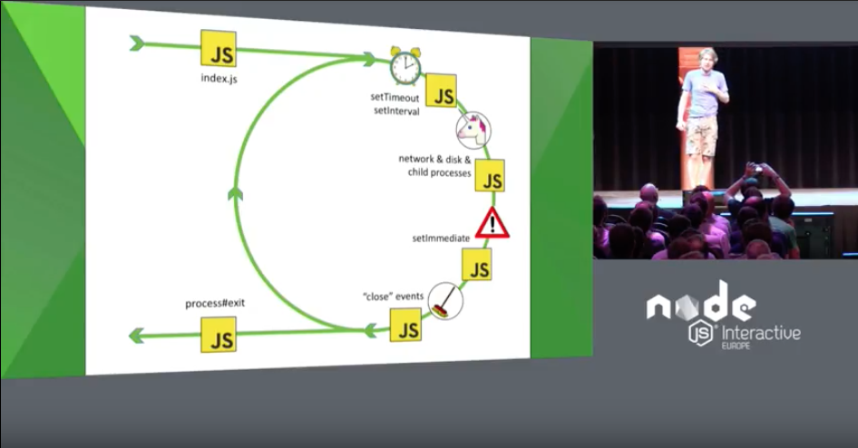
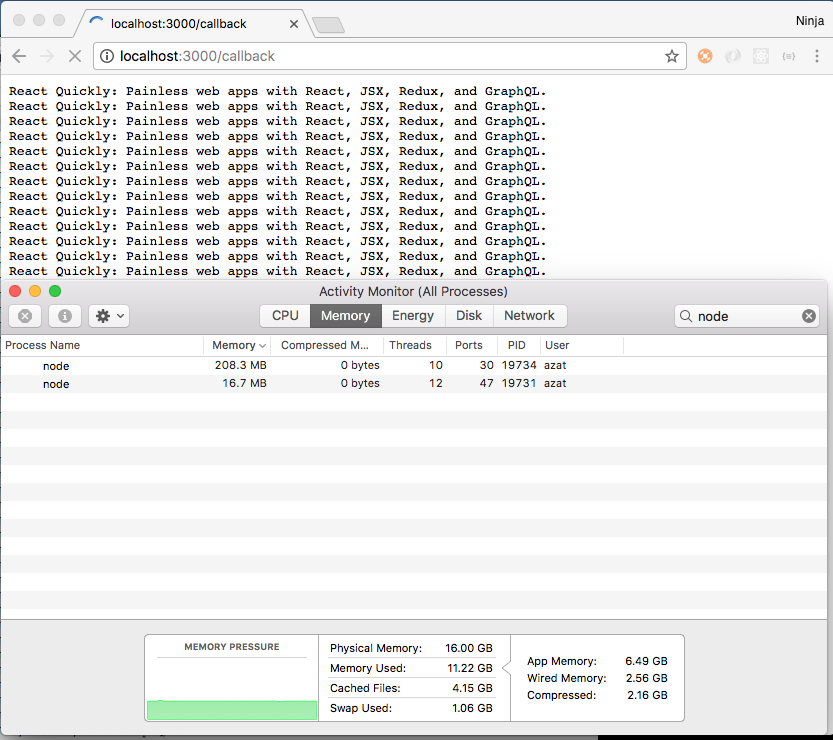
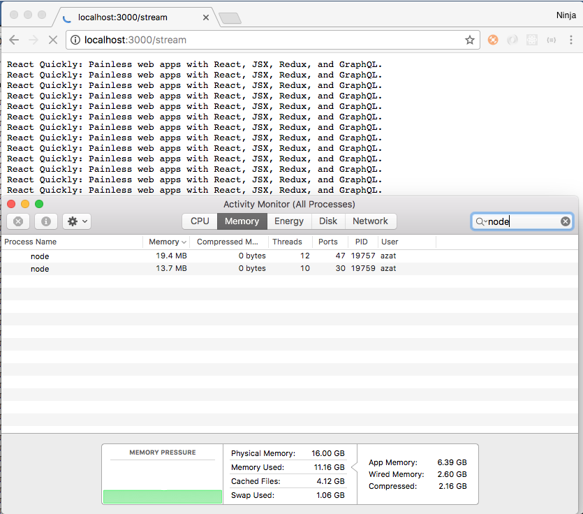

footer: © NodeProgram.com, Node.University and Azat Mardan 2018
slidenumbers: true
theme: Simple, 1
build-lists: true
autoscale:true

[.slidenumbers: false] 
[.hide-footer]


---

# Node Advanced
## Overview


Azat Mardan @azat_co


---

# Node Advanced


* Videos: <http://node.university/p/node-advanced>
* Slides: in `*.md` in <https://github.com/azat-co/node-advanced>
* Code: in `code` in <https://github.com/azat-co/node-advanced>

---

# Course Overview

---

## Course Overview

* Table of Contents
* What to expect
* What you need

---

## Curriculum

---

## Curriculum

1. Node Modules
1. Node Event Loop and Async Programming
1. Streaming
1. Networking
1. Debugging
1. Scaling


---

## What to Expect

Focus on:

* Pure Node
* Core Node modules
* ES6-8

---

## What not to Expect

Do not expect:

* Not much JavaScript fundamentals and no old ES5
* Not much Linux, Unix, Windows or computer fundamentals
* Not many fancy npm modules or frameworks 

---

## Prerequisites

* Node Foundation: <https://node.university/p/node-npm-and-mongodb-foundation>
* You Don't Know Node: <https://node.university/p/you-dont-know-node>
* Node Patterns: <https://node.university/p/node-patterns>

---


## What You Need

* Node version 8+: `node -v`
* npm version 5+: `npm -v`
* Google Chrome
* Slides&code: <https://github.com/azat-co/node-advanced>

---

## Mindset

* Embrace errors
* Increase curiosity
* Experiment by iteration
* Get comfortable reading source code of Nodejs, npm, and npm modules
* Enjoy the process

---

## Reading Source Code

You learn how to use a module *and* how to be a better developer

* <https://github.com/nodejs/node>
* <https://github.com/npm/npm>
* <https://github.com/expressjs/express>

---

## Tips for Deeper (Advanced) Understanding

* Learn to think like V8 (a JS+Node engine): When in doubt, use `console.log` or debugger to walk through execution 
* Read call stack error message carefully. Learn and know common errors (address in use, cannot find module, undefined, etc.)
* Upgrade your tools (No Notepad ++, seriously)

---

## Tips for Deeper (Advanced) Understanding (Cont)

* Memorize all the array, string and Node core methods - saves tons of time and keeps focus (can work offline too)
* Read good books, take in-person classes from good instructors and watch good video courses
* Build side-projects
* Subscribe to Node Weekly to stay up-to-date
* Teach

---

# Module 1: Modules

---

## Importing Modules with `require()`

1. Resolving
1. Loading
1. Wrapping
1. Evaluating
1. Caching

---

## Modules Can Have Code

`code/modules/module-1.js`:

```js
console.log(module) // console.log(global.module)
```

---

```js
Module {
  id: '.',
  exports: {},
  parent: null,
  filename: '/Users/azat/Documents/Code/node-advanced/code/module-1.js',
  loaded: false,
  children: [],
  paths:
   [ '/Users/azat/Documents/Code/node-advanced/code/node_modules',
     '/Users/azat/Documents/Code/node-advanced/node_modules',
     '/Users/azat/Documents/Code/node_modules',
     '/Users/azat/Documents/node_modules',
     '/Users/azat/node_modules',
     '/Users/node_modules',
     '/node_modules' ] }
```

---

## `require()`

* local paths takes precedence (0 to N)
* module can be a file or a folder with `index.js` (or any file specified in package.json main in that nested folder)
* `loaded` is true when this file is imported/required by another
* `id` is the path when this file is required by another
* `parent` and `children` will be populated accordingly

---

## `require.resolve()` 

Check if the package exists/installed or not but does not execute

---

## How `require()` Checks Files

1. Try `name.js`
1. Try `name.json`
1. Try `name.node` (compiled addon example)
1. Try `name` folder, i.e., `name/index.js`

---

## `require.extensions`

{ '.js': [Function], '.json': [Function], '.node': [Function] }

---

## Caching

Running require() twice will not print twice but just once:

```
cd code/modules && node
> require('./module-1.js')
...
> require('./module-1.js')
{}
```

(Or run `modules/main.js`)

---

> A better way to execute code multiple times is to export it and then invoke

---


## Exporting Module


---

## Exporting Code

```
module.exports = () => {

}
```

---

## CSV to Node Object Converter Module

```
code/modules/module-2.js
```

```js
module.exports.parse = (csvString = '') => {
  const lines = csvString.split('\n')
  let result = []
  ...
  return result
}
```

---

## CSV to Node Object Converter Main Program

```
code/modules/main-2.js
```

```js
const csvConverter = require('./module-2.js').parse

const csvString = `id,first_name,last_name,email,gender,ip_address
...
10,Allin,Bernadot,abernadot9@latimes.com,Male,15.162.216.199`

console.log(csvConverter(csvString))
```

---

## Module Patterns

* Export Function
* Export Class
* Export Function Factory 
* Export Object
* Export Object with Methods

More on these patterns at [Node Patterns](https://node.university/p/node-patterns)

---

## Exporting Tricks and Gotchas

```js
module.exports.parse = () => {} // ok
exports.parse = () => {} // ok
global.module.exports.parse = () => {}  // not ok, use local module
```

---

## Exporting Tricks and Gotchas (Cont)

```js
exports.parse = ()=>{} // ok
module.exports = {parse: ()=>{} } // ok again 
exports = {parse: ()=>{} } // not ok, creates a new variable
```

---

## Module Wrapper Function

Keeps local vars local

`require('module').wrapper`

```
node
> require('module').wrapper
[ '(function (exports, require, module, __filename, __dirname) { ',
  '\n});' ]
```

---

## Tricky Local Globals 

`exports` and `require` are specific to each module, not true global global, same with `__filename` and `__dirname`

```js
console.log(global.module === module) // false
console.log(arguments)
```

---

## What You Export === What You Use

```js
module.exports = { 
  parse: (csv) => {
    //...
  }
}
```

Importing object, so use: 

```js
const parse = require('./name.js').parse
const {parse} = require('./name.js') // or
parse(csv)
```

---

## What You Export === What You Use (Cont)
 
```js
const Parser = { 
  parse(csv) {
    // ...
  }
}
module.exports = Parser
```

Again importing object, so use: 

```js
const parse = require('./name.js').parse
const {parse} = require('./name.js') // or
parse(csv)
```

---

## What You Export === What You Use (Cont)

```js
module.exports = () => { 
  return {
    parse: (csv) => {}
  }
}
```

Importing function, not object, so use:

```js
const {parse} = require('./namejs')()
const parse = require('./namejs')().parse
```

(`modules/main-3.js` and `modules/module-3.js`)

---

## What You Export === What You Use (Cont)

```js
class Parser extends BaseClass {
  parse(csv) {
    // ...
  }
}
module.exports = Parser
```

```js
const Parser = require('./namejs')
const parser = new Parser()
const parse = parser.parse // or const {parse} = parser
```

---

## `import` vs `import()` vs `require()`

* [import](https://developer.mozilla.org/en-US/docs/Web/JavaScript/Reference/Statements/import) is static and require is dynamic
* *.mjs experimental https://nodejs.org/api/esm.html
* import() method ([stage 3](https://github.com/tc39/proposal-dynamic-import))
* No `require.extensions` or `require.cache` in import 

---

## Node experimental ESM support

```js
import fs from 'fs'
import('./button.js')
```

For now, it's better to use Babel or just stick with `require`

---

## Caching

`require.cache` has the cache

---

## Clear Cache

`main-4.js` prints twice (unlike `main-1.js`):

```js
require('./module-4.js')
delete req
uire.cache[require.resolve('./module-4.js')]
require('./module-4.js')
```


---

## Global

```js
var limit = 1000 // local, not available outside
const height = 50 // local
let i = 10 // local
console = () => {} // global, overwrites console outside
global.Parser = {} // global, available in other files
max = 999 // global too
```

---

## npm

* registry
* cli: folders, git, private registries (self hosted npm, Nexus, Artifactory)

* yarn
* pnpm

---

## npm Git

```
npm i expressjs/express -E

```

```
npm i expressjs/express#4.14.0 -E
npm install https://github.com/indexzero/forever/tarball/v0.5.6
npm install git+ssh://git@github.com:npm/npm#semver:^5.0
npm install git+https://isaacs@github.com/npm/npm.git
```

When in doubt: `npm i --dry-run express`

---

## npm ls 

```
npm ls express
npm ls -g --depth=0
npm ll -g --depth=0
npm ls -g --depth=0 --json
```

npm installs in ~/node_modules (if no local)


---

## Creating package.json For Lazy Programmers


```
npm init -y
```

---

## Setting Init Configs

List: 

```
npm config ls
```


---

## My npm Configs: cli, user, global

```
; cli configs
scope = ""
user-agent = "npm/4.2.0 node/v7.10.1 darwin x64"

; userconfig /Users/azat/.npmrc
init-author-name = "Azat Mardan"
init-author-url = "http://azat.co/"
init-license = "MIT"
init-version = "1.0.1"
python = "/usr/bin/python"

; node bin location = /Users/azat/.nvm/versions/node/v7.10.1/bin/node
; cwd = /Users/azat/Documents/Code/node-advanced
; HOME = /Users/azat
; "npm config ls -l" to show all defaults.
```

---


## Configs for npm init

```
init-author-name = "Azat Mardan"
init-author-url = "http://azat.co/"
init-license = "MIT"
init-version = "1.0.1"
```

---

## Setting up npm registry Config

```
npm config set registry "http://registry.npmjs.org/"
```

or 

edit `~/.npmrc`, e.g., `/Users/azat/.npmrc`

---

## Setting up npm proxy

```
npm config set https-proxy http://proxy.company.com:8080
npm config set proxy http://proxy_host:port
```

Note: The https-proxy doesn't have https as the protocol, but http.

---

## Dependency Options

* `npm i express -S` (default in npm v5)
* `npm i express -D`
* `npm i express -O`
* `npm i express -E`

---

## `npm update` and `npm outdated`

* `<` and `<=`
* `=`
* `.x`
* `~`
* `^`
* `>` and `>=`

---

## npm Tricks

```
npm home express
npm repo express
npm docs express
```

---

## npm Linking for Developing CLI Tools

```
npm link 
npm unlink
```

---

# Module 2: Node Event Loop and Async Programming

---

## Event loop

---

## Two Categories of Tasks

* CPU-bound
* I/O-bound

---

## CPU Bound Tasks

CPU-bound tasks examples:

* Encryption
* Password
* Encoding
* Compression
* Calculations

---

## Input and Output Bound Tasks

Input/Output examples:

* Disk: write, read
* Networking: request, response
* Database: write, read

---

> CPU-bound tasks are not the bottleneck in networking apps. The I/O tasks are the bottleneck because they take up more time typically.

---

## Dealing with Slow I/O

* Synchronous 
* Forking (later module)
* Threading (more servers, computers, VMs, containers)
* Event loop (this module)

---

## Call Stack

> Uses push, pop functions on the FILO/LIFO/LCFS basis, i.e., functions removed from top (opposite of queue).

^https://techterms.com/definition/filo

---

## Call Stack Illustration

```js
const f3 = () => {
  console.log('executing f3')
  undefinedVariableError //  ERROR!
}
const f2 = () => {
  console.log('executing f2')
  f3()
}
const f1 = () => {
  console.log('executing f1')
  f2()
}

f1()
```

---

## Call Stack as a Bucket

Starts with Anonymous, then f1, f2, etc.

```
f3() // last in the bucket but first to go
f2()
f1()
anonymous() // first in the bucket but last to go
```

---

## Call Stack Error

```
> f1()
executing f1
executing f2
executing f3
ReferenceError: undefinedVariableError is not defined
    at f3 (repl:3:1)
    at f2 (repl:3:1)
    at f1 (repl:3:1)
    at repl:1:1
    at ContextifyScript.Script.runInThisContext (vm.js:23:33)
    at REPLServer.defaultEval (repl.js:339:29)
    at bound (domain.js:280:14)
    at REPLServer.runBound [as eval] (domain.js:293:12)
    at REPLServer.onLine (repl.js:536:10)
    at emitOne (events.js:101:20)
```


---


## Event Queue

FIFO to push to call stack

---

## Async Callback Messes Call Stack

```js
const f3 = () => {
  console.log('executing f3')
  setTimeout(()=>{
    undefinedVariableError // STILL an ERROR but async in this case
  }, 100)
}
const f2 = () => {
  console.log('executing f2')
  f3()
}
const f1 = () => {
  console.log('executing f1')
  f2()
}

f1()
```

---

## Different Call Stack! 

No f1, f2, f3 for the `setTimeout` callback call stack because event loop moved one, i.e., error comes from a different event queue:

```
> f1()
executing f1
executing f2
executing f3
undefined
> ReferenceError: undefinedVariableError is not defined
    at Timeout.setTimeout [as _onTimeout] (repl:4:1)
    at ontimeout (timers.js:386:14)
    at tryOnTimeout (timers.js:250:5)
    at Timer.listOnTimeout (timers.js:214:5)
>
```

---


## Event Loop Order of Operation:

1. Timers
1. I/O callbacks
1. Idle, prepare
1. Poll (incoming connections, data)
1. Check
1. Close callbacks

^https://nodejs.org/en/docs/guides/event-loop-timers-and-nexttick/

[.autoscale: true]

---

## Phases Overview

1. Timers: this phase executes callbacks scheduled by setTimeout() and setInterval().
1. I/O callbacks: executes almost all callbacks with the exception of close callbacks, the ones scheduled by timers, and setImmediate().
1. Idle, prepare: only used internally.
1. Poll: retrieve new I/O events; node will block here when appropriate.
1. Check: setImmediate() callbacks are invoked here.
1. Close callbacks: e.g. socket.on('close', ...).

[.autoscale: true]

---


<https://youtu.be/PNa9OMajw9w?t=5m48s>

---



---

## setTimeout vs. setImmediate vs. process.nextTick

* `setTimeout(fn, 0)` - pushes to the *next* event loop cycle
* `setImmediate()` similar to `setTimeout()` with 0 but timing is different sometimes, it is recommended when you need to execute on the next cycle
* `process.nextTick` - not the next cycle (same cycle!), used to make functions fully async or to postpone code for events

---

## nextTick Usage

All callbacks passed to process.nextTick() will be resolved before the event loop continues

* To emit event after `.on()`
* To make some sync code async

---

## Event Emit nextTick Example in http

In http, to make sure event listeners are attached before emitting error (or anything else), [source](https://github.com/nodejs/node/blob/3b8da4cbe8a7f36fcd8892c6676a55246ba8c3be/lib/_http_client.js#L205):

```js
    if (err) {
      process.nextTick(() => this.emit('error', err));
      return;
    }
```


---

## Async or Sync Error Handling in fs

To postpone callback if it's set (async) or throw error right away (sync), [source](https://github.com/nodejs/node/blob/8aec3638cebd338b0ea2a62c3e1469b8e29616d7/lib/fs.js#L363):

```js
function handleError(val, callback) {
  if (val instanceof Error) {
    if (typeof callback === 'function') {
      process.nextTick(callback, val);
      return true;
    } else throw val;
  }
  return false;
}
```

---

## Async Code Syntax 

* Just Callbacks: code and data are arguments
* Promises: code is separate from data
* Generators and Async/await: look like sync but actually async

---

## Error-First Callback

Define your async function:

```js
const myFn = (cb) => {
  // Define error and data
  // Do something...
  cb(error, data)
}
```

---

## Error-First Callback Usage

Use your function: 

```js
myFn((error, data)=>{
  
})
```

---

## Arguments Naming

Argument names don't matter but the order does matter, put errors first and callbacks last:

```js
myFn((err, result)=>{
  
})
```

---

## Error-First

Errors first but the callback last

> Popular convention but not enforced by Node)

---

## Arguments Order and Callback-First?

Some functions don't follow error-first and use callback first, e.g., `setTimeout(fn, time)`.

---

## Callback-First

With the ES6 rest operator, it might make sense to start using callback-first style more because rest can only be the last parameter, e.g. 

```js
const myFn = (cb, ...options) => {

}
```

---

## How to Know What is The Function Signature

1. You created it so you should know
2. Someone else created it, thus, always know others modules by reading source code, checking documentation, testing and reading examples, tests, tutorials.

---

## Callbacks not Always Async

Sync code which has a function as an argument. :

```js
const arr = [1, 2, 3]
arr.map((item, index, list) => {
  return item*index // called arr.length times
})
```

---

## Promises

> Externalize the callback code and separate it from the data arguments

---

## Promises for Developers

* Consume a ready promise from a library/module (`axios`, `koa`, etc.) - most likely
* Create your own using ES6 Promise or a library ([bluebird]() or [q](https://documentup.com/kriskowal/q/)) - less likely


---

## Usage and Consumption of Ready Promises

---

## Callbacks Syntax 

Where to put the callback and does the error argument go first? 

```js
asyncFn1((error1, data1) => {
  asyncFn2(data1, (error2, data2) => {
    asyncFn3(data2, (error3, data3) => {
      asyncFn4(data3, (error4, data4) => {
        // Do something with data4
      })
    })
  })
})
```

---

## Promise Syntax

Clear separation of data and control flow arguments:

```js
promise1(data1)
  .then(promise2)
  .then(promise3)
  .then(promise4)
  .then(data4=>{
    // Do something with data4
  })
  .catch(error=>{
    // handle error1, 2, 3 and 4
  })
```

---

## Axios GET Example

```js
const axios = require('axios')
axios.get('http://azat.co')
  .then((response)=>response.data)
  .then(html => console.log(html))
```  

---

## Axios GET Error Example

```js
const axios = require('axios')
axios.get('https://azat.co') // https will cause an error!
  .then((response)=>response.data)
  .then(html => console.log(html))
  .catch(e=>console.error(e))
```

Error: Hostname/IP doesn't match certificate's altnames: "Host: azat.co. is not in the cert's altnames: DNS:*.github.com, DNS:github.com, DNS:*.github.io, DNS:github.io"

---

##  Let's implement our own naive promise. 

### We can learn how easy promises are, and this is advanced course after all so why not?

---

## Naive Promise: Callback Async Function

```js
function myAsyncTimeoutFn(data, callback) {
  setTimeout(() => {
    callback()
  }, 1000)
}

myAsyncTimeoutFn('just a silly string argument', () => {
  console.log('Final callback is here')
})
```

---

## Naive Promise: Implementation

```js
function myAsyncTimeoutFn(data) {
  let _callback = null
  setTimeout( () => {
    if ( _callback ) callback()
  }, 1000)
  return {
    then(cb){
      _callback = cb
    }
  }

}

myAsyncTimeoutFn('just a silly string argument').then(() => {
  console.log('Final callback is here')
})
```

---

## Naive Promise: Implementation with Errors

```js
const fs = require('fs')
function readFilePromise( filename ) {
  let _callback = () => {}
  let _errorCallback = () => {}

  fs.readFile(filename, (error, buffer) => {
    if (error) _errorCallback(error)
    else _callback(buffer)
  })

  return {
    then( cb, errCb ){
      _callback = cb
      _errorCallback = errCb
    }
  }

}
```

---

## Naive Promise: Reading File

```js
readFilePromise('package.json').then( buffer => {
  console.log( buffer.toString() )
  process.exit(0)
}, err => {
  console.error( err )
  process.exit(1)
})
```

---

## Naive Promise: Triggering Error

```js
readFilePromise('package.jsan').then( buffer => {
  console.log( buffer.toString() )
  process.exit(0)
}, err => {
  console.error( err )
  process.exit(1)
})
```

```
{ Error: ENOENT: no such file or directory, open 'package.jsan'
  errno: -2,
  code: 'ENOENT',
  syscall: 'open',
  path: 'package.jsan' }
```

---

## Creating Promises Using The Standard ES6/ES2015 Promise

---

## ES6/ES2015 Promise in Node

Node version 8+ (v8 not V8):

```
Promise === global.Promise
```

ES6 `Promise` takes callback with `resolve` and `reject`

---

## Simple Promise Implementation with ES6/ES2015

```js
const fs = require('fs')
function readJSON(filename, enc='utf8'){
  return new Promise(function (resolve, reject){
    fs.readFile(filename, enc, function (err, res){
      if (err) reject(err)
      else {
        try {
          resolve(JSON.parse(res))
        } catch (ex) {
          reject(ex)
        }
      }
    })
  })
}

readJSON('./package.json').then(console.log)
```

---

## Advanced Promise Implementation with ES6/ES2015 for Both Promises and Callbacks

```js
const fs = require('fs')

const readFileIntoArray = function(file, cb = null) {
  return new Promise((resolve, reject) => {
    fs.readFile(file, (error, data) => {
      if (error) {
        if (cb) return cb(error) 
        return reject(error)
      }

      const lines = data.toString().trim().split('\n')
      if (cb) return cb(null, lines)
      else return resolve(lines)
    })
  })
}
```

---

## Example Calls with `then` and a Callback

```js
const printLines = (lines) => {
  console.log(`There are ${lines.length} line(s)`)
  console.log(lines)
}
const FILE_NAME = __filename

readFileIntoArray(FILE_NAME)
  .then(printLines)
  .catch(console.error)

readFileIntoArray(FILE_NAME, (error, lines) => {
  if (error) return console.error(error)
  printLines(lines)
})
```

---

## Event Emitters

1. Import `require('events')`
1. Extend `class Name extends ...`
1. Instantiate `new Name()`
1. Add listeners `.on()`
1. Emit `.emit()`

---

## Emitting Outside Event Emitter Class


```js
const events = require('events')
class Encrypt extends events {
  constructor(ops) {
    super(ops)
    this.on('start', () => {
      console.log('beginning A')
    })    
    this.on('start', () => {
      console.log('beginning B')
    })
  }
}

const encrypt = new Encrypt()
encrypt.emit('start')
```

---

## Emitting Outside and Inside

```js
const events = require('events')
class Encrypt extends events {
  constructor(ops) {
    super(ops)
    this.on('start', () => {
      console.log('beginning A')
    })    
    this.on('start', () => {
      console.log('beginning B')
      setTimeout(()=>{
        this.emit('finish', {msg: 'ok'})
      }, 0)
    })
  }
}

const encrypt = new Encrypt()
encrypt.on('finish', (data) => {
  console.log(`Finshed with message: ${data.msg}`)
})
encrypt.emit('start')
```

---

## Working with Events

Events are about building extensible functionality and making modular code flexible

* `.emit()` can be in the module and `.on()` in the main program which consumes the module
* `.on()` can be in the module and `.emit()` in the main program, and in constructor or in instance
* pass data with `emit()`
* `error` is a special event (if listen to it then no crashes)
* `on()` execution happen in the order in which they are defined (`prependListener` or `removeListener`)

[.autoscale: true]

---

## Default Max Event Listeners

Default maximum listeners is 10 (to find memory leaks), use `setMaxListeners` ([source](https://github.com/nodejs/node/blob/master/lib/events.js#L81))

```js
var defaultMaxListeners = 10;
...
EventEmitter.prototype.setMaxListeners = function setMaxListeners(n) {
  if (typeof n !== 'number' || n < 0 || isNaN(n)) {
    const errors = lazyErrors();
    throw new errors.RangeError('ERR_OUT_OF_RANGE', 'n',
                                'a non-negative number', n);
  }
  this._maxListeners = n;
  return this;
};
```

---

## Promises vs Events

* Events are synchronous while Promises are *typically* asynchronous
* Events react to same event from multiple places, Promise just from one call
* Events react to same event multiple times, `then` just once

---

## nextTick in class 

Again, nextTick helps to emit events later such as in a class constructor

```js
class Encrypt extends events {
  constructor() {
    process.nextTick(()=>{  // otherwise, emit will happen before .on('ready')
      this.emit('ready', {})
    })
  }
}
const encrypt = new Encrypt()
encrypt.on('ready', (data) => {})
```

---

## Async/await

---

## How Developers Use Async/await 

* Consume ready async/await functions from libraries which support it - often
* Create your own from callback or promises - not often (Node's `util.promisify`)

You need Node v8+ for both

---

## Consuming Async Fn from axios

```js
const axios = require('axios')
const getAzatsWebsite = async () => {
  const response = await axios.get('http://azat.co')
  return response.data
}
getAzatsWebsite().then(console.log)
```

---

## `util.promisify`

```js
const util = require('util')
const f = async function() {
  try {
    await util.promisify(setTimeout)(()=>{consoleg.log('here')}, 1000)
  } catch(e) {
    await Promise.reject(new Error('test'))
  }
}

f()
```

(Can be use just for Promises as well)

---

## Consuming Async Fn from mocha and axios

```js
const axios = require('axios')
const {expect} = require('chai')
const app = require('../server.js')
const port = 3004

before(async function() {
  await app.listen(port, () => {
    console.log('server is running')
  })
  console.log('code after the server is running')
})
```

---

## Consuming Async Fn from mocha and axios (Cont)

```js
describe('express rest api server', async () => {
  let id

  it('posts an object', async () => {
    const {data: body} = await axios
      .post(`http://localhost:${port}/collections/test`, 
      { name: 'John', email: 'john@rpjs.co'})
    expect(body.length).to.eql(1)
    expect(body[0]._id.length).to.eql(24)
    id = body[0]._id
  })

  it('retrieves an object', async () => {
    const {data: body} = await axios
      .get(`http://localhost:${port}/collections/test/${id}`)
    expect(typeof body).to.eql('object')
    expect(body._id.length).to.eql(24)
    expect(body._id).to.eql(id)
    expect(body.name).to.eql('John')
  })
  // ...
})
```

---

## Project: Avatar Service

Koa Server with Mocha and Async/await Fn and Promise.all

Terminal:

```
cd code
cd koa-rest
npm i
npm start
```

Open in a Browser: <http://localhost:3000/?email=YOUEMAIL>, e.g., <http://localhost:3000/?email=hi@node.university> to see your avatar (powered by Gravatar)

---

# Module 3: Streaming

---

## Abstractions for continuous chunking of data or simply data which is not available all at once and which does NOT require too much memory.

---

## No need to wait for the entire resource to load

---

## Types of Streams

* Readable, e.g., `fs.createReadStream`
* Writable, e.g., `fs.createWriteStream`
* Duplex, e.g., `net.Socket`
* Transform, e.g., `zlib.createGzip`

---

## Streams Inherit from Event Emitter

---

## Streams are Everywhere!

* HTTP requests and responses
* Standard input/output (stdin&stdout)
* File reads and writes

---

## Readable Stream Example

`process.stdin`

Standard input streams contain data going into applications.

* Event data: `on('data')`
*  `read()` method


---

## Input typically comes from the keyboard used to start the process.

To listen in on data from stdin, use the `data` and `end` events:

```js
// stdin.js
process.stdin.resume()
process.stdin.setEncoding('utf8')

process.stdin.on('data', function (chunk) {
  console.log('chunk: ', chunk)
})

process.stdin.on('end', function () {
  console.log('--- END ---')
})
```

---

## Demo

`$ node stdin.js`

---

## Interface `read()`

```js
var readable = getReadableStreamSomehow()
readable.on('readable', () => {
  var chunk
  while (null !== (chunk = readable.read())) { // SYNC!
    console.log('got %d bytes of data', chunk.length)
  }
})
```

^readable.read is sync but the chunks are small

---

## Writable Stream Example

* `process.stdout`: Standard output streams contain data going out of the applications.
* `response` (server request handler response)
* `request` (client request)

More on networking in the next module

---


## Write to Writable Stream

Use `write()` method

```js
process.stdout.write('A simple message\n')
```

Data written to standard output is visible on the command line.

---

## Pipe

```
source.pipe(destination)
```

source - readable or duplex
destination - writable, or transform or duplex

---

## Linux vs Node Piping

Linux shell:

```
operationA | operationB | operationC | operationD
```

Node :

```js
streamA.pipe(streamB).pipe(streamC).pipe(streamD)
```

or

```js
streamA.pipe(streamB)
streamB.pipe(streamC)
streamC.pipe(streamD)
```

---


```
                                                   +===================+
                         x-->  Piping functions   +-->   src.pipe(dest)  |
                         x     are set up during     |===================|
                         x     the .pipe method.     |  Event callbacks  |
  +===============+      x                           |-------------------|
  |   Your Data   |      x     They exist outside    | .on('close', cb)  |
  +=======+=======+      x     the data flow, but    | .on('data', cb)   |
          |              x     importantly attach    | .on('drain', cb)  |
          |              x     events, and their     | .on('unpipe', cb) |
+---------v---------+    x     respective callbacks. | .on('error', cb)  |
|  Readable Stream  +----+                           | .on('finish', cb) |
+-^-------^-------^-+    |                           | .on('end', cb)    |
  ^       |       ^      |                           +-------------------+
  |       |       |      |
  |       ^       |      |
  ^       ^       ^      |    +-------------------+         +=================+
  ^       |       ^      +---->  Writable Stream  +--------->  .write(chunk)  |
  |       |       |           +-------------------+         +=======+=========+
  |       |       |                                                 |
  |       ^       |                              +------------------v---------+
  ^       |       +-> if (!chunk)                |    Is this chunk too big?  |
  ^       |       |     emit .end();             |    Is the queue busy?      |
  |       |       +-> else                       +-------+----------------+---+
  |       ^       |     emit .write();                   |                |
  |       ^       ^                                   +--v---+        +---v---+
  |       |       ^-----------------------------------<  No  |        |  Yes  |
  ^       |                                           +------+        +---v---+
  ^       |                                                               |
  |       ^               emit .pause();          +=================+     |
  |       ^---------------^-----------------------+  return false;  <-----+---+
  |                                               +=================+         |
  |                                                                           |
  ^            when queue is empty     +============+                         |
  ^------------^-----------------------<  Buffering |                         |
               |                       |============|                         |
               +> emit .drain();       |  ^Buffer^  |                         |
               +> emit .resume();      +------------+                         |
                                       |  ^Buffer^  |                         |
                                       +------------+   add chunk to queue    |
                                       |            <---^---------------------<
                                       +============+
```                                       

---

## Pipe and Transform

Encrypts and Zips:

```js
const r = fs.createReadStream('file.txt')
const e = crypto.createCipher('aes256', SECRET) 
const z = zlib.createGzip()
const w = fs.createWriteStream('file.txt.gz')
r.pipe(e).pipe(z).pipe(w)
```

^Readable.pipe takes writable and returns destination

---


---

## With pipe, we can listen to events too!

```js
const r = fs.createReadStream('file.txt')
const e = crypto.createCipher('aes256', SECRET) 
const z = zlib.createGzip()
const w = fs.createWriteStream('file.txt.gz')
r.pipe(e)
  .pipe(z).on('data', () => process.stdout.write('.') // progress dot "."
  .pipe(w).on('finish', () => console.log('all is done!')) // when all is done
```

---

## Readable Stream

paused: `stream.read()` - safe
`stream.resume()`

flowing: EventEmitter - data can be lost if no listeners or they are not ready
`stream.pause()`

---

## What about HTTP?

---

## Core http uses Streams!

```js
const http = require('http')
var server = http.createServer( (req, res) => {
  req.setEncoding('utf8')
  req.on('data', (chunk) => { // readable
    processDataChunk(chunk) // This functions is defined somewhere else
  })
  req.on('end', () => {  
    res.write('ok') // writable
    res.end()
  })
})

server.listen(3000)
```

---

## Streaming for Servers

`streams/large-file-server.js`:

```js
const path = require('path')
const fileName = path.join(
  __dirname, process.argv[2] || 'webapp.log') // 67Mb
const fs = require('fs')
const server = require('http').createServer()

server.on('request', (req, res) => {
  if (req.url === '/callback') {
    fs.readFile(fileName, (err, data) => {
      if (err) return console.error(err)
      res.end(data)
    })
  } else if (req.url === '/stream') {
    const src = fs.createReadStream(fileName)
    src.pipe(res)
  }
})

server.listen(3000)
```

---



---



---

## Before we were consuming streams, not let's create our own stream. This is ~~Sparta~~ advanced course after all!

---

## Create a Stream

```js
const stream = require('stream')
const writable = new stream.Writable({...})
const readable = new stream.Readable({...})
const transform = new stream.Transform({...})
const duplex = new stream.Duplex({...})
```

or 

```js
const {Writable} = require('stream')
const writable = new Writable({...})
```

---

## Create a Writable Stream

```js
const translateWritableStream = new Writable({
  write(chunk, encoding, callback) {
    translate(chunk.toString(), {to: 'en'}).then(res => {
        console.log(res.text)
        //=> I speak English
        console.log(res.from.language.iso)
        //=> nl
        callback()
    }).catch(err => {
        console.error(err)
        callback()
    })
  }
})
```

streams/writable-translate.js


---

## Creating Readable

```js
const {Readable} = require('stream')
const Web3 = require('web3')
const web3 = new Web3(new Web3.providers.HttpProvider("https://mainnet.infura.io/jrrVdXuXrVpvzsYUkCYq"))

const latestBlock = new Readable({
  read(size) {
    web3.eth.getBlock('latest')
      .then((x) => {
        // console.log(x.timestamp)
        this.push(`${x.hash}\n`)
        // this.push(null)
      })
  }
})

latestBlock.pipe(process.stdout)
```

---

## Creating Duplex

```js
const {Duplex} = require('stream')

const MyDuplex = new Duplex ({
  write(chunk, encoding, callback) {
    callback()
  }
  read(size) {
    this.push(data) // data defined
    this.push(null)
  }
})
```

---

## Creating Transform 

```js
const {Transform} = require('stream')

const MyTransform = new Transform({
  transform(chunk, encoding, callback) {
    this.push(data)
    callback()
  }
})
```

---

## Transform Real Life Example: Zlib from Node Source

```js
Zlib.prototype._transform = function _transform(chunk, encoding, cb) {
  // If it's the last chunk, or a final flush, we use the Z_FINISH flush flag
  // (or whatever flag was provided using opts.finishFlush).
  // If it's explicitly flushing at some other time, then we use
  // Z_FULL_FLUSH. Otherwise, use the original opts.flush flag.
  var flushFlag;
  var ws = this._writableState;
  if ((ws.ending || ws.ended) && ws.length === chunk.byteLength) {
    flushFlag = this._finishFlushFlag;
  } else {
    flushFlag = this._flushFlag;
    // once we've flushed the last of the queue, stop flushing and
    // go back to the normal behavior.
    if (chunk.byteLength >= ws.length)
      this._flushFlag = this._origFlushFlag;
  }
  processChunk(this, chunk, flushFlag, cb);
};
```

Node source on GitHub: <https://github.com/nodejs/node/blob/master/lib/zlib.js#L395>

---

## Backpressure

* Data clogs 
* Reading typically is faster than writing
* Backpressure is bad for memory exhaustion and GC (triggering GC too often is expensive)
* Stream and Node solves the back pressure automatically by pausing source (read) stream if needed
* `highWaterMark` option, defaults to 16kb

---

## Overwrite Streams

Since Node.js v0.10, the Stream class has offered the ability to modify the behaviour of the .read() or .write() by using the underscore version of these respective functions (._read() and ._write()).

[Guide](https://nodejs.org/en/docs/guides/backpressuring-in-streams)


---

# Module 4: Networking

---

## net

---

## Any server, not just http or https!

```js
const server = require('net').createServer()
server.on('connection', socket => {
  socket.write('Enter your command: ') // Sent to client
  socket.on('data', data => {
    // Incoming data from a client
  })

  socket.on('end', () => {
    console.log('Client disconnected')
  })
})

server.listen(3000, () => console.log('Server bound'))
```

---

## Chat

chat.js:

```js
if (!sockets[socket.id]) {
  socket.name = data.toString().trim()
  socket.write(`Welcome ${socket.name}!\n`)
  sockets[socket.id] = socket
  return
}
Object.entries(sockets).forEach(([key, cs]) => {
  if (socket.id === key) return
  cs.write(`${socket.name} ${timestamp()}: `)
  cs.write(data)
})
```    

---

## Client?

```
telnet localhost 3000
```

or

```
nc localhost 3000
```

or write your own TCP/IP client using Node, C++, Python, etc.

---

## Bitcoin Price Ticker 

`node code/bitcoin-price-ticker.js`

---

## Ticker Server

```js
const https = require('https')

const server = require('net').createServer()
let counter = 0
let sockets = {}
server.on('connection', socket => {
  socket.id = counter++

  console.log('Welcome to Bitcoin Price Ticker (Data by Coindesk)')
  console.log(`There are ${counter} clients connected`)
  socket.write('Enter currency code (e.g., USD or CNY): ')

  socket.on('data', data => {
    // process data from the client
  })

  socket.on('end', () => {
    delete sockets[socket.id]
    console.log('Client disconnected')
  })
})

server.listen(3000, () => console.log('Server bound'))
```

---

## Processing Data from the Client

```js
    let currency = data.toString().trim()
    if (!sockets[socket.id]) {
      sockets[socket.id] = {
        currency: currency
      }
      console.log(currency)
    }
    fetchBTCPrice(currency, socket)
    clearInterval(sockets[socket.id].interval)
    sockets[socket.id].interval = setInterval(()=>{
      fetchBTCPrice(currency, socket)
    }, 5000)
```

---

## Making request to [Coindesk API](https://www.coindesk.com/api/) (HTTPS!)

API: https://api.coindesk.com/v1/bpi/currentprice/<CODE>.json

<https://api.coindesk.com/v1/bpi/currentprice/USD.json>
<https://api.coindesk.com/v1/bpi/currentprice/JPY.json>
<https://api.coindesk.com/v1/bpi/currentprice/RUB.json>
<https://api.coindesk.com/v1/bpi/currentprice/NYC.json>

---


## Response

```json
{
  "time": {
    "updated": "Jan 9, 2018 19:52:00 UTC",
    "updatedISO": "2018-01-09T19:52:00+00:00",
    "updateduk": "Jan 9, 2018 at 19:52 GMT"
  },
  "disclaimer": "This data was produced from the CoinDesk 
  Bitcoin Price Index (USD). Non-USD currency data 
  converted using hourly conversion rate from openexchangerates.org",
  "bpi": {
    "USD": {
      "code": "USD",
      "rate": "14,753.6850",
      "description": "United States Dollar",
      "rate_float": 14753.685
    }
  }
}
```

---

## HTTPS GET

```js
const fetchBTCPrice = (currency, socket) => {
  const req = https.request({
    port: 443,
    hostname: 'api.coindesk.com',
    method: 'GET',
    path: `/v1/bpi/currentprice/${currency}.json`
  }, (res) => {
    let data = ''
    res.on('data', (chunk) => {
      data +=chunk
    })
    res.on('end', () => {
      socket.write(`1 BTC is ${JSON.parse(data).bpi[currency].rate} ${currency}\n`)
    })
  })
  req.end()
}
```


---

## Client

```
telnet localhost 3000
Trying 127.0.0.1...
Connected to localhost.
Escape character is '^]'.
Enter currency code (e.g., USD or CNY): USD
1 BTC is 14,707.9438 USD
1 BTC is 14,694.5113 USD
1 BTC is 14,694.5113 USD
CNY
1 BTC is 40,202.5000 CNY
RUB
1 BTC is 837,400.5342 RUB
1 BTC is 837,400.5342 RUB
1 BTC is 837,400.5342 RUB
```

---

## http

static file server (file-server.js)

```js
const url = require('url')
const SECRET = process.env.SECRET
const server = require('http').createServer((req, res) => {
  console.log(`URL is ${req.url} and the method is ${req.method}`)
  const courseId = req.url.match(/courses\/([0-9]*)/)[1] // works for /courses/123 to get 123
  const query = url.parse(req.url, true).query // works for /?key=value&key2=value2 
  if (courseId && API_KEY===SECRET) {
    fs.readFile('./archive.sql', (error, data)=>{
      if (error) {
        res.writeHead(500)
        res.end()
      } else {
        res.writeHead(200, {'Content-Type': 'text/plain' })
        res.end(data)
      }
    })
  }
}).listen(3000, () => {
  console.log('server is listening on 3000')
})
```

---

## HTTP File Server

Command to run the server:

```
SECRET=NNN nodemon file-server.js
```

Browser request: <http://localhost:3000/courses/123?API_KEY=NNN>

---

## HTTP Routing

You can use switch... 

```js
const server = require('http').createServer((req, res) => {
  switch (req.url) {
    case '/api':
      res.writeHead(200, { 'Content-Type': 'application/json' })
      // fetch data from a database
      res.end(JSON.stringify(data))
      break
    case '/home':
      res.writeHead(200, { 'Content-Type': 'text/html' })
      // send html from a file
      res.end(html)
      break
    default:
      res.writeHead(404)
      res.end()
  }
}).listen(3000, () => {
  console.log('server is listening on 3000')
})
```

---

## HTTP Routing Puzzle

Find a problem with this server (from [Advanced Node by Samer Buna](https://app.pluralsight.com/player?course=nodejs-advanced&author=samer-buna&name=nodejs-advanced-m5&clip=3&mode=live)):

```js
const fs = require('fs')
const server = require('http').createServer()
const data = {}

server.on('request', (req, res) => {
  switch (req.url) {
  case '/api':
    res.writeHead(200, { 'Content-Type': 'application/json' })
    res.end(JSON.stringify(data))
    break
  case '/home':
  case '/about':
    res.writeHead(200, { 'Content-Type': 'text/html' })
    res.end(fs.readFileSync(`.${req.url}.html`))
    break
  case '/':
    res.writeHead(301, { 'Location': '/home' })
    res.end()
    break
  default:
    res.writeHead(404)
    res.end()
  }
})

server.listen(3000)
```

---

## Puzzle Answer

Always reading (no caching) and blocking!

```js
  case '/about':
    res.writeHead(200, { 'Content-Type': 'text/html' })
    res.end(fs.readFileSync(`.${req.url}.html`))
    break
```


---

## Use HTTP Status Codes

```
http.STATUS_CODES
```

---

## Core `https` Module

Server needs the key and certificate files:

```
openssl req -x509 -newkey rsa:2048 -nodes -sha256 -subj '/C=US/ST=CA/L=SF/O=NO\x08A/OU=NA' \
  -keyout server.key -out server.crt
```  

---

## HTTPS Server with Core `https` Module

```js
const https = require('https')
const fs = require('fs')

const server = https.createServer({
  key: fs.readFileSync('server.key'),
  cert: fs.readFileSync('server.crt')
}, (req, res) => {
  res.writeHead(200)
  res.end('hello')
}).listen(443)
```

---

## `https` Request with Streaming

```js
const https = require('https') 

const req = https.request({
    hostname: 'webapplog.com',
    port: 443, 
    path: '/',
    method: 'GET'
  }, (res) => {
  console.log('statusCode:', res.statusCode)
  console.log('headers:', res.headers)

  res.on('data', (chunk) => {
    process.stdout.write(chunk)
  })
})

req.on('error', (error) => {
  console.error(error)
})
req.end()
```

---


## HTTP/2 with `http2`

---

## Generating Self-Signed SSL

```
openssl req -x509 -newkey rsa:2048 -nodes -sha256 -subj '/C=US/ST=CA/L=SF/O=NO\x08A/OU=NA' \
  -keyout server.key -out server.crt
```  


---

## Using Core `http2` Module

```js
const http2 = require('http2')
const fs = require('fs')

const server = http2.createSecureServer({
  key: fs.readFileSync('server.key'),
  cert: fs.readFileSync('server.crt')
}, (req, res) => {
  res.writeHead(200, {'Content-Type': 'text/plain' })
  res.end('<h1>Hello World</h1>') // JUST LIKE HTTP!
})
server.on('error', (err) => console.error(err))
server.listen(3000)
```


---

## Running H2 Hello Server
```
cd code
cd http2
node h2-hello.js
```

Browser: <https://localhost:3000>

Terminal:

```
curl https://localhost:3000/ -vik
```

---


---


---


---


---

```
curl https://localhost:3000/ -vik
```

```
 Trying 127.0.0.1...
* Connected to localhost (127.0.0.1) port 3000 (#0)
* ALPN, offering h2
* ALPN, offering http/1.1
* Cipher selection:
...
* SSL connection using TLSv1.2 / ECDHE-RSA-AES128-GCM-SHA256
* ALPN, server accepted to use h2
* Server certificate:
*  subject: C=US; ST=CA; L=SF; O=NOx08A; OU=NA
* Using HTTP2, server supports multi-use
* Connection state changed (HTTP/2 confirmed)
```

---

## Using Core `http2` Module with Stream

```js
const http2 = require('http2')
const fs = require('fs')

const server = http2.createSecureServer({
  key: fs.readFileSync('server.key'),
  cert: fs.readFileSync('server.crt')
})

server.on('error', (err) => console.error(err))
server.on('socketError', (err) => console.error(err))

server.on('stream', (stream, headers) => {
  // stream is a Duplex
  stream.respond({
    'content-type': 'text/html',
    ':status': 200
  })
  stream.end('<h1>Hello World</h1>')
})

server.listen(3000)
```

---

## WTF is http2 Server Push?

---

## Example: index.html refers to four static assets

HTTP/1: server requires five requests from a client:

1. index.html
2. style.css
3. bundle.js
4. favicon.ico
5. logo.png

---

## Example: index.html refers to four static assets (Cont)

HTTP/2: server with server push requires just one request from a client: 

1. index.html
  * style.css
  * bundle.js
  * favicon.ico
  * logo.png

---

> HTML and assets are pushed by the server but assets are not used unless referred to by HTML.

---

## Let's implement some server push!

---

## Start with a Normal H2 Server

```js
const http2 = require('http2')
const fs = require('fs')

const server = http2.createSecureServer({
  key: fs.readFileSync('server.key'),
  cert: fs.readFileSync('server.crt')
})

server.on('error', (err) => console.error(err))
server.on('socketError', (err) => console.error(err))
```

---

## Use Stream and `pushStream`

```js
server.on('stream', (stream, headers) => {
  stream.respond({
    'content-type': 'text/html',
    ':status': 200
  })
  stream.pushStream({ ':path': '/myfakefile.js' }, (pushStream) => {
    pushStream.respond({ 
      'content-type': 'text/javascript',
      ':status': 200 
    })
    pushStream.end(`alert('you win')`)
  })
  stream.end('<script src="/myfakefile.js"></script><h1>Hello World</h1>')
})

server.listen(3000)
```

---


---

## Additional server push articles

* [What’s the benefit of Server Push?](https://http2.github.io/faq/#whats-the-benefit-of-server-push)
* [Announcing Support for HTTP/2 Server Push](https://blog.cloudflare.com/announcing-support-for-http-2-server-push-2)
* [Innovating with HTTP 2.0 Server Push](https://www.igvita.com/2013/06/12/innovating-with-http-2.0-server-push)

---

## Demo: Advanced Express REST API routing in HackHall

---

## Conclusion

### Just don't use core http directly. Use Express, Hapi or Koa.


---

# Module 5: Debugging


---

## Debugging Strategies

* Don't guess and don't think too much
* Isolate (use binary search)
* Watch/check values
* Trial and error
* Full Stack overflow development (skip question, read answers)
* Read source code, docs can be outdated or subpar

---

## `console.log` is one of the best debuggers

* Not breaking the execution flow
* Nothing extra needed (unlike Node Inspector/DevTools or VS Code)
* Robust: clearly shows if a line is executed
* Clearly shows data

---

## Console Tricks

---

## Streaming logs to files

```js
const fs = require('fs')

const out = fs.createWriteStream('./out.log')
const err = fs.createWriteStream('./err.log')

const console2 = new console.Console(out, err)

setInterval(() => {
  console2.log(new Date())
  console2.error(new Error('Whoops'))
}, 500)
```

---

```js
console.log('Step', 2) // Step2
const name = 'Azat'
const city = 'San Francisco'
console.log('Hello %s from %s', name, city)
```

---

```js
const util = require('util')
console.log(util.format('Hello %s from %s', name, city)) // Hello Azat from San Francisco
console.log('Hello %s from %s', 'Azat', {city: 'San Francisco'}) // Hello Azat from [object Object]
console.log({city: 'San Francisco'}) // { city: 'San Francisco' }
console.log(util.inspect({city: 'San Francisco'})) // { city: 'San Francisco' }
```

---

```js
const str = util.inspect(global, {depth: 0})
console.dir(global, {depth: 0})
```

```
info = log
warn = error
trace // prints call stack
assert // require('assert')
```

---

## Console Timers

```js
console.log('Ethereum transaction started')
console.time('Ethereum transaction')
web3.send(txHash, (error, results)=>{
  console.timeEnd('Ethereum transaction') // Ethereum transaction: 4545.921ms
})
```

---

## Real Debuggers

* CLI
* DevTools
* VS Code


---

## Node CLI Debugger

```
$ node inspect debug-me.js
< Debugger listening on ws://127.0.0.1:9229/80e7a814-7cd3-49fb-921a-2e02228cd5ba
< For help see https://nodejs.org/en/docs/inspector
< Debugger attached.
Break on start in myscript.js:1
> 1 (function (exports, require, module, __filename, __dirname) { global.x = 5;
  2 setTimeout(() => {
  3   console.log('world');
debug>
```

---

```
Stepping#
cont, c - Continue execution
next, n - Step next
step, s - Step in
out, o - Step out
pause - Pause running code (like pause button in Developer Tools)
```

---

## Node V8 Inspector

```
$ node --inspect index.js
Debugger listening on 127.0.0.1:9229.
To start debugging, open the following URL in Chrome:
    chrome-devtools://devtools/bundled/inspector.html?experiments=true&v8only=true&ws=127.0.0.1:9229/dc9010dd-f8b8-4ac5-a510-c1a114ec7d29
```


better to break right away:

```
$ node --inspect --debug-brk index.js
```

---

## Node V8 Inspector Demo

---

## VS Code Demo

---


## CPU profiling

---

## Networking Debugging with DevTools

---

# Module 6: Scaling

---

## Why You Need to Scale

* Performance (e.g., under 100ms response time)
* Availability (e.g., 99.999%)
* Fault tolerance (e.g., zero downtime)

^Zero downtime
^ Offload the workload: when Node server is a single process, it can be easily blocked
^https://blog.interfaceware.com/disaster-recovery-vs-high-availability-vs-fault-tolerance-what-are-the-differences/

---

## Scaling Strategies

* Forking (just buy more EC2s) - what we will do
* Decomposing (e.g., microservices just for bottlenecks) - in another course
* Sharding (e.g., eu.docusign.com and na2.docusign.net) - not recommended

---

## Offload the workload

* `spawn()` - events, stream, messages, no size limit, no shell
* `fork()` - Node processes, exchange messages
* `exec()` - callback, buffer, 1Gb size limit, creates shell
* `execFile()` - exec file, no shell

---

* `spawnSync()`
* `execFileSync()`
* `execSync()`
* `forkSync()`

---

## Executing bash and spawn params

```js
const {spawn} = require('child_process')
spawn('cd $HOME/Downloads && find . -type f | wc -l', 
  {stdio: 'inherit', 
  shell: true, 
  cwd: '/', 
  env: {PASSWORD: 'dolphins'}
})
```

---

## Executing Python with exec

```js

```

---

## `os` Module

---

```js
const os = require('os')
console.log(os.freemem())
console.log(os.type())
console.log(os.release())
console.log(os.cpus())
console.log(os.uptime())
console.log(os.networkInterface())
```

---

```
{ lo0:
   [ { address: '127.0.0.1',
       netmask: '255.0.0.0',
       family: 'IPv4',
       mac: '00:00:00:00:00:00',
       internal: true },
  ...
  en0:
   [ { address: '10.0.1.4',
       netmask: '255.255.255.0',
       family: 'IPv4',
       mac: '78:4f:43:96:c6:f1',
       internal: false } ],
  ...  
```  

```
ifconfig | grep "inet " | grep -v 127.0.0.1
```

---

## CPU Usage in %

```js
//os-cpu.js
const os = require('os')
let cpus = os.cpus()

cpus.forEach((cpu, i) => {
  console.log('CPU %s:', i)
  let total = 0

  for (let type in cpu.times) {
    total += cpu.times[type]
  }

  for (let type in cpu.times) {
    console.log(`\t ${type} ${Math.round(100 * cpu.times[type] / total)}%`)
  }
})
```

---

## Free Memory

* `free = 

TK

---

## Garbage collection

TK

---

Useful Libraries

*
* <https://www.npmjs.com/package/systeminformation> and <https://github.com/sebhildebrandt/systeminformation>


---

##  cluster


---

* Master process
* Worker processes: it's own PID, event loop and memory space
* Load testing - round robin or the second approach is where the master process creates the listen socket and sends it to interested workers. The workers then accept incoming connections directly.
* Use the child_process.fork() method and messaging

---

## Round Robin uses shift and push


```js
RoundRobinHandle.prototype.distribute = function(err, handle) {
  this.handles.push(handle);
  const worker = this.free.shift();

  if (worker)
    this.handoff(worker);
};
```

Source: <https://github.com/nodejs/node/blob/master/lib/internal/cluster/round_robin_handle.js#L84>

---

##  Load testing

---

```
npm i loadtest -g
loadtest -c 10 --rps 100 10.0.1.4:3000
```

or

```
ab -c 200 -t 10 http://localhost:3000
```

---

## With Cluters

Avoid In-memory caching (each cluster has its own memory) or sticky sessions. Use external state store.

##  Cluster Messaging

---

Master:

```js
cluster.workers
worker.send(data)
```

Worker:

```js
process.on('message', data=>{})
```


---

##  Offloading CPU-intensive tasks


Slow server

node server-v1.js

```
curl localhost:3000/signup -d '{"password":123}' -H "Content-Type: application/json" -X POST
curl localhost:3000
```

---

Server with forked hashing (worker-v2.js)

node server-v2.js

---


Server with forked cluster 

node server-v3.js

```js

```

---

Node.js does not automatically manage the number of workers, however. It is the application's responsibility to manage the worker pool based on its own needs.

---

## Fault Tolerance

```
ps aux | grep 'node'
kill 12668
```

---

in `isMaster`:

```js
  cluster.on('exit', (worker, code, signal) => {
    if (signal) {
      console.log(`worker was killed by signal: ${signal}`);
    } else if (code !== 0) { // &&!worker.exitedAfterDisconnect
      console.log(`worker exited with error code: ${code}`);
    } else {
      console.log('worker success!');
    }
    const newWorker = cluster.fork()
    console.log(`Worker ${worker.process.pid} exited. Thus, starting a new worker ${newWorker.process.pid}`)
  })
```

---

## pm2 Basics

```
npm i -g pm2
pm2 start app.js Start, Daemonize and auto-restart application (Node)
pm2 start app.js --watch
pm2 start app.js --name="bitcoin-exchange-api"
pm2 reset bitcoin-exchange-api
pm2 stop all
pm2 stop bitcoin-exchange-api
```

---

## pm2 Advanced

```
pm2 startup
pm2 save
pm2 unstartup 
pm2 start app.js -i 4         # Start 4 instances of application in cluster mode 
                              # it will load balance network queries to each app
pm2 start app.js -i 4         # Start auto-detect instances of application in cluster mode  
pm2 reload all                # Zero Second Downtime Reload
pm2 scale [app-name] 10       # Scale Cluster app to 10 process
```

---

## pm2 More

```
pm2-dev
pm2-docker
```

---

# Outro

---

## Summary
